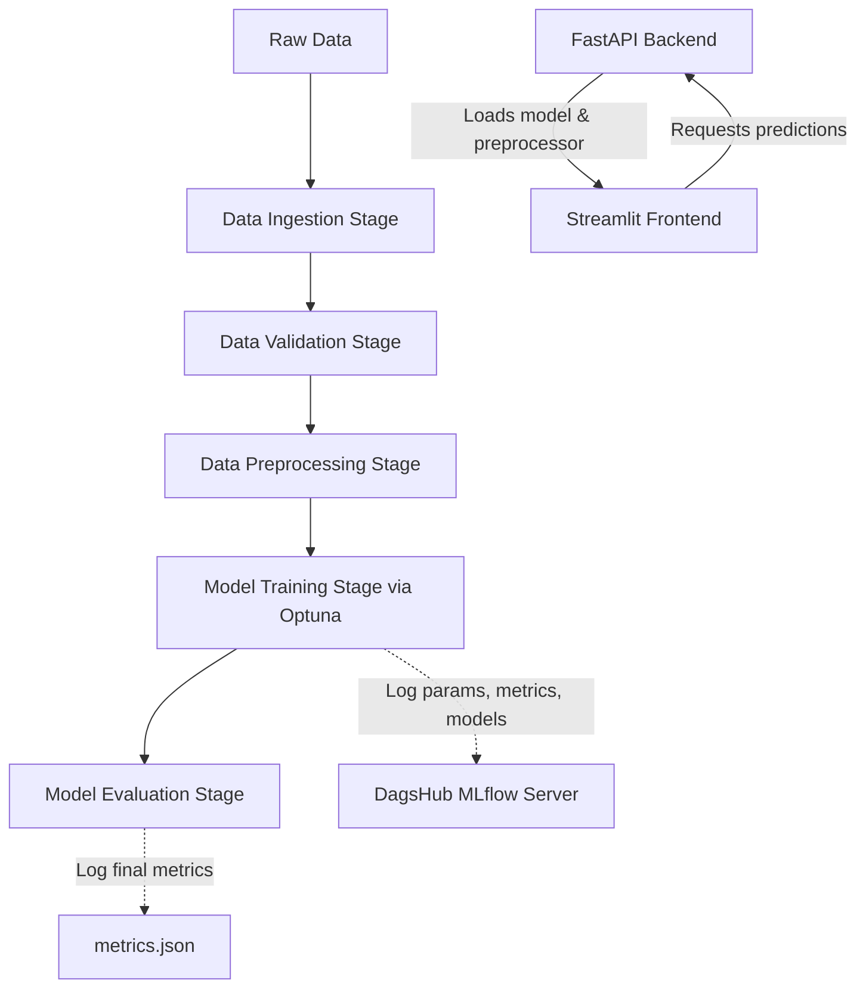

# 🎓 Student Placement Prediction (End-to-End MLOps Project)

[](https://mlflow.org/)
[](https://dvc.org/)
[](https://optuna.org/)
[](https://fastapi.tiangolo.com/)
[](https://streamlit.io/)
[](https://github.com/features/actions)
[](https://aws.amazon.com/)

An end-to-end Machine Learning Operations (MLOps) pipeline designed to predict student placement status (placed vs. not placed) using academic metrics and demographic features. The system is built with a highly decoupled modular architecture, integrated with **DVC** for pipeline control, **Optuna** for automated hyperparameter tuning, **MLflow & DagsHub** for experiment tracking, and fully containerized/deployed using **Docker**, **AWS ECR**, and **AWS EC2** via **GitHub Actions**.

---

## 🏗️ System Architecture & Workflow



---

## 📂 Project Structure

```directory
.
├── .github/workflows/   # CI/CD workflows (GitHub Actions deploy.yml)
├── app/                 # Web application & prediction endpoints
│   ├── api.py           # FastAPI service serving prediction endpoints
│   └── streamlit_app.py # Streamlit UI for user interaction
├── src/                 # Main pipeline source code
│   ├── Pipeline/        # Sequential stage definitions (Ingestion to Evaluation)
│   ├── components/      # Functional modules for ingestion, validation, preprocess, trainer, evaluation
│   ├── config/          # Configurations manager mapping params/schema
│   ├── constants/       # Workspace file-path constants
│   ├── entity/          # Typed configuration entities
│   └── utils/           # Helper/utility scripts
├── artifacts/           # Outputs generated by pipeline steps (DVC controlled)
├── config/              # YAML config mapping files
├── params.yaml          # Hyperparameters configuration for Optuna and steps
├── schema.yaml          # Data schema definition & preprocessing metadata
├── dvc.yaml             # DVC pipeline stages and dependencies configuration
├── Dockerfile           # Multi-port containerization definition
└── requirements.txt     # Project Python dependencies
```

---

## 🧬 MLOps Pipeline Stages (Managed by DVC)

The pipeline workflow is standardized and tracked via [dvc.yaml](file:///Users/ozenhadrick/Desktop/Mlops%20project%201/dvc.yaml):

1. **Data Ingestion (`stage_1_ingestion.py`):** Fetches the dataset from remote source/storage, verifies and stores it inside the local artifacts folder.
2. **Data Validation (`stage_2_validation.py`):** Validates column structures, data types, and values against [schema.yaml](file:///Users/ozenhadrick/Desktop/Mlops%20project%201/schema.yaml) to ensure data integrity before training.
3. **Data Preprocessing (`stage_3_preprocess.py`):** Handles missing values, performs categorical encoding (Label Encoder), scales features, and exports split train/test datasets along with serialization files (`preprocess.pkl`, `label_encoder.pkl`).
4. **Model Training & Hyperparameter Tuning (`stage_4_training.py`):** 
   - Explores multiple classifiers: **XGBoost**, **LightGBM**, and **CatBoost**.
   - Leverages **Optuna** to optimize search space parameters.
   - Automatically tracks the objective search on a hosted **DagsHub MLflow** remote server.
   - Fits the best parameters on the full training dataset and logs the model artifact.
5. **Model Evaluation (`stage_5_evaluation.py`):** Tests model parameters against the test set and exports accuracy, precision, recall, and F1 score into `artifacts/model_evaluation/metrics.json`.

---

## 📈 Experiment Tracking & Hyperparameter Tuning

Hyperparameter optimization is fully automated and logged remotely to **DagsHub** via **MLflow**:

* **Optuna Search:** Evaluates classifier options (`xgboost`, `lightgbm`, `catboost`) using cross-validation.
* **MLflow Integration:** Auto-logs study metrics, optimal parameter sets, and serialized models.
* **Initialization Configuration:**
  ```python
  import mlflow
  import dagshub
  dagshub.init(repo_owner='YOUR_DAGSHUB_USERNAME', repo_name='YOUR_REPOSITORY', mlflow=True)
  ```

---

## 🚀 Getting Started

### 1. Prerequisites
- Python 3.12+
- Docker installed locally (if containerizing)

### 2. Local Setup
Clone the repository, configure virtual environment, and install dependencies:

```bash
# Create and activate virtual environment
python -m venv .venv
source .venv/bin/activate  # On Windows: .venv\Scripts\activate

# Install external packages & setup project in editable mode
pip install -r requirements.txt
pip install -e .
```

### 3. Run Pipeline Stages
You can run the full pipeline sequentially through python:

```bash
python main.py
```

Or run and track steps natively with **DVC**:
```bash
dvc repro
```

### 4. Running the Web Applications Locally

Create a `.env` file in the root directory:
```env
API_URL=http://127.0.0.1:8000/predict
```

1. **Launch FastAPI Backend Service:**
   ```bash
   uvicorn app.api:app --host 0.0.0.0 --port 8000
   ```
2. **Launch Streamlit Frontend Interface:**
   ```bash
   streamlit run app/streamlit_app.py --server.address=0.0.0.0 --server.port=8501
   ```

---

## 🐳 Docker Containerization

To package the entire app (both the Streamlit web front and FastAPI prediction API):

```bash
# Build the Docker image
docker build -t student-placement-app .

# Run the container (Expose FastAPI on 8000 and Streamlit on 8501)
docker run -p 8501:8501 -p 8000:8000 -e API_URL="http://<EC2_PUBLIC_IP_OR_LOCALHOST>:8000/predict" student-placement-app
```

---

## 🌐 Production CI/CD Deployment (AWS EC2 + ECR)

The project includes automated deployment pipelines via GitHub Actions in [.github/workflows/deploy.yml](file:///Users/ozenhadrick/Desktop/Mlops%20project%201/.github/workflows/deploy.yml).

### CI/CD Deployment Flow:
1. **GitHub Push:** Developer pushes changes to `master` branch.
2. **Test & Verify:** GitHub Runner installs dependencies, runs tests via `pytest`, and tests pipeline validity using `dvc repro --dry`.
3. **AWS Authorization:** GitHub Runner authenticates with AWS via configured credentials.
4. **ECR Push:** Builder builds Docker image, tags it as `latest`, and pushes it to **Amazon Elastic Container Registry (ECR)**.
5. **EC2 Run:** The runner connects to the **Amazon EC2** server using SSH, pulls the updated image from ECR, and starts the FastAPI server container (`ml-api`) and Streamlit web application (`ml-app`).

### Security Groups Setup on AWS EC2
Ensure your EC2 Security Group allows traffic on the following ports:
- **Port 8501** (Custom TCP) - Accessible from anywhere `0.0.0.0/0` for the Streamlit UI.
- **Port 8500 / 8000** (Custom TCP) - Exposing backend prediction endpoints.

---

> [!WARNING]
> Keep your AWS access keys (`AWS_ACCESS_KEY`, `AWS_SECRET_KEY`) and EC2 credentials (`EC2_HOST`, `EC2_USER`, `EC2_SSH_KEY`) stored securely inside **GitHub Repository Secrets**. Never hardcode credentials into configuration files.
